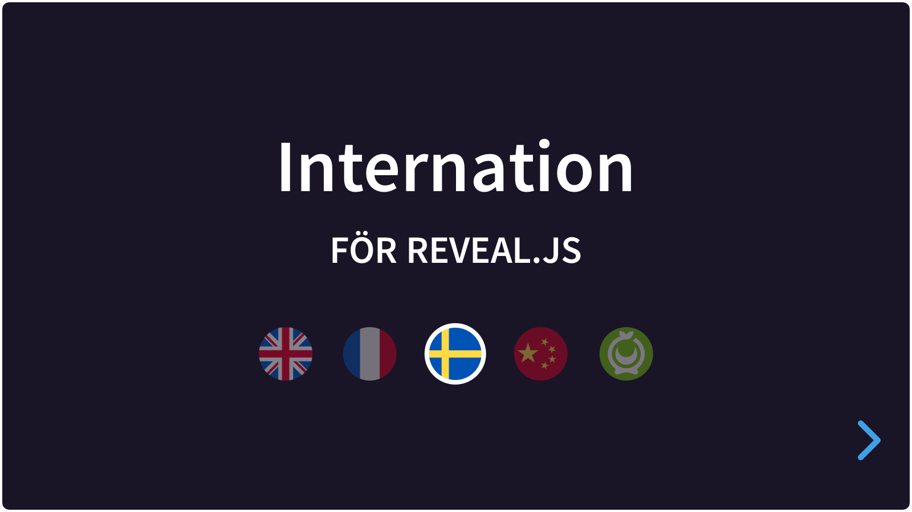

# Internation

A simple plugin for [Reveal.js](https://revealjs.com) 4, that can let the user choose a language for the presentation.

This Readme is not finished yet :-)

A few points:

* You will need to make JSON files.
* You may generate your first JSON file by setting the makejson option to true. This will immediately download a JSON file generated from the current HTML content, but you will still need to tag the texts with a data-attribute in advance.
* Sections need ID's for this plugin to work, so you can always move your slides around later on.
